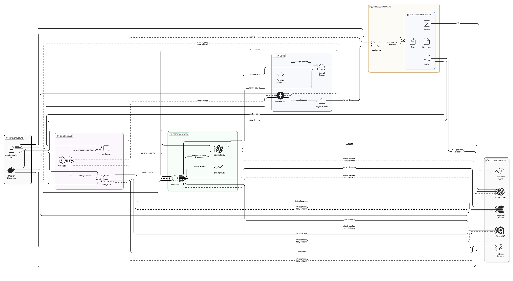

## B2B Multimodal Memory

Hệ thống bộ nhớ đa phương thức cho quy trình bán hàng B2B kéo dài và đa kênh (chat, email, meeting/call, file, ảnh). Kiến trúc gồm 4 tầng: ingestion → processing → storage → retrieval, triển khai bằng FastAPI, Qdrant (Vector DB), MinIO (Object Storage), và tích hợp Elasticsearch (keyword) + RAG (LLM) tùy chọn.

## 🏗️ **System Architecture**




### **Kiến trúc mức cao**
- **INFRASTRUCTURE**: Quản lý cấu hình và deployment (requirements.txt, Docker Compose)
- **CORE MODULE**: Cấu hình, models, storage logic (config.py, models.py, storage.py)
- **API LAYER**: FastAPI app với routers cho ingest và search
- **PROCESSING PIPELINE**: Xử lý đa phương thức (text, image, document, audio)
- **RETRIEVAL SYSTEM**: Hybrid search và answer generation
- **EXTERNAL SERVICES**: Tesseract OCR, OpenAI API, Elasticsearch, Qdrant, MinIO

### **Luồng dữ liệu chính**
1. **Ingestion**: Dữ liệu được nhận qua API → chuyển đến Processing Pipeline
2. **Processing**: Xử lý theo modality → OCR cho image, STT cho audio, text cleaning
3. **Storage**: Embedding → lưu vào Vector DB (Qdrant), Object Storage (MinIO), Keyword Index (Elasticsearch)
4. **Retrieval**: Hybrid search kết hợp vector + keyword → RAG generation với OpenAI API

## 🚀 **Tính năng mới đã bổ sung**


### **Monitoring & Observability**
- ✅ **Health Checks**: `/health`, `/health/detailed`, `/health/ready`, `/health/live`
- ✅ **System Monitoring**: Prometheus + Grafana dashboard
- ✅ **Structured Logging**: Request tracking với unique ID
- ✅ **Performance Metrics**: Response time, throughput monitoring

### **Security & Reliability**
- ✅ **Security Headers**: CORS, XSS protection, Content Security Policy
- ✅ **Rate Limiting**: Configurable rate limiting per IP
- ✅ **Error Handling**: Custom exceptions và global error handling
- ✅ **Fault Tolerance**: Graceful degradation khi services unavailable

### **Administration & Management**
- ✅ **Admin Panel**: `/admin/*` endpoints cho system management
- ✅ **Cache Management**: Cache stats, clear cache operations
- ✅ **Storage Monitoring**: Qdrant, MinIO, Elasticsearch status
- ✅ **System Info**: CPU, memory, disk usage monitoring

### **Performance & Scalability**
- ✅ **Caching Layer**: In-memory cache với TTL configurable
- ✅ **Async Processing**: Non-blocking operations
- ✅ **Connection Pooling**: Database connection management
- ✅ **Horizontal Scaling**: Ready for load balancer deployment

## Kiến trúc mức cao
- Ingestion: nhận dữ liệu từ text, file (pdf/docx/txt), email, chat, audio, image.
- Processing: chuẩn hóa, chunking, embedding; OCR (image) bằng Tesseract; STT audio (stub, có thể thay bằng Whisper).
- Storage: Qdrant (vector), MinIO (object gốc), Elasticsearch (BM25 từ khóa) + payload metadata.
- Retrieval: hybrid search (vector + keyword + rescoring) và tổng hợp câu trả lời kiểu RAG (OpenAI tùy chọn) có trích nguồn.

## Công nghệ sử dụng
- **Ngôn ngữ & Runtime**: Python 3.11+, Uvicorn (ASGI server)
- **Web Framework**: FastAPI với middleware stack
- **Vector Database**: Qdrant
- **Object Storage**: MinIO (S3 compatible)
- **Keyword Search**: Elasticsearch (BM25)
- **Caching**: Redis + In-memory cache
- **Embeddings**: Sentence-Transformers
- **OCR**: Tesseract OCR (cài native) + Pillow + pytesseract
- **Document parsing**: pypdf, python-docx
- **Audio STT**: stub (có thể thay bằng Whisper/faster-whisper)
- **RAG/LLM**: OpenAI (qua `OPENAI_API_KEY`)
- **Monitoring**: Prometheus + Grafana
- **Orchestration**: Docker Compose (Qdrant, MinIO, Elasticsearch, Redis, Prometheus, Grafana)

## Cài đặt nhanh (Windows)
1) Tạo `.env` (nếu bạn chưa có):
```powershell
cd C:\Users\ASUS\Desktop\b2b-multimodal-memory
notepad .env
```
Ví dụ nội dung tối thiểu:
```env
QDRANT_URL=http://localhost:6333
QDRANT_COLLECTION=mm_memory
VECTOR_DIM=384
EMBEDDING_PROVIDER=random

MINIO_ENDPOINT=localhost:9000
MINIO_ACCESS_KEY=minioadmin
MINIO_SECRET_KEY=minioadmin
MINIO_BUCKET=mm-raw
MINIO_SECURE=false

ES_URL=http://localhost:9200
ES_INDEX=mm_memory

REDIS_URL=redis://localhost:6379

API_PORT=8080
LOG_LEVEL=INFO
LOG_FILE=logs/app.log
```

2) Khởi động hạ tầng (Qdrant, MinIO, Elasticsearch, Redis, Prometheus, Grafana):
```powershell
docker compose up -d
```

3) Cài dependencies (khuyến nghị venv):
```powershell
python -m venv venv
.\venv\Scripts\Activate.ps1
pip install -r requirements.txt
```

4) Chạy API:
```powershell
uvicorn src.api.main:app --reload --port 8080
```

5) Truy cập các services:
- **API Documentation**: http://localhost:8080/docs
- **Grafana Dashboard**: http://localhost:3000 (admin/admin)
- **Prometheus**: http://localhost:9090
- **MinIO Console**: http://localhost:9001 (minioadmin/minioadmin)

## Cấu trúc thư mục
```
b2b-multimodal-memory/
├── .env(.example)                    
├── docker-compose.yml               
├── requirements.txt                  
├── README.md                        
├── data/                            
├── notebooks/                       
├── monitoring/                      
│   └── prometheus.yml              
├── docs/                          
│   └── images/                     
│       └── Architecture.png         
└── src/                             
    ├── __init__.py
    ├── api/                         # API Layer
    │   ├── __init__.py
    │   ├── main.py                  # FastAPI app với middleware
    │   ├── schemas.py               # Pydantic models và validation
    │   └── routers/                 # API endpoints
    │       ├── __init__.py
    │       ├── ingest_routes.py     # Ingest endpoints (text, file, email, chat, audio, image)
    │       ├── search_routes.py     # Search endpoints (search, timeline, delete)
    │       ├── health_routes.py     # Health check endpoints
    │       └── admin_routes.py      # Admin management endpoints
    ├── core/                        # Core Module
    │   ├── __init__.py
    │   ├── config.py                # Environment configuration loader
    │   ├── models.py                # Embedding models (random/sentence-transformers)
    │   ├── storage.py               # Storage connectors (Qdrant, MinIO, Elasticsearch)
    │   ├── exceptions.py            # Custom exception classes
    │   ├── logging.py               # Structured logging configuration
    │   ├── middleware.py            # Security, logging, rate limiting middleware
    │   ├── health.py                # Health check services
    │   └── cache.py                 # In-memory caching layer
    ├── ingestion/                   # Data Ingestion
    │   ├── __init__.py
    │   ├── email_ingestor.py        # Email integration (Gmail/Graph placeholder)
    │   ├── chat_ingestor.py         # Chat integration (Slack/Teams/Zalo placeholder)
    │   └── file_uploader.py         # File upload handling
    ├── processing/                  # Processing Pipeline
    │   ├── __init__.py
    │   ├── pipeline.py              # Main processing orchestrator
    │   ├── text_processor.py        # Text cleaning, chunking, summarization
    │   ├── document_processor.py    # PDF/DOCX text extraction
    │   ├── audio_processor.py       # Audio STT (Whisper integration)
    │   └── image_processor.py       # Image OCR (Tesseract)
    └── retrieval/                   # Retrieval System
        ├── __init__.py
        ├── search.py                # Hybrid search (vector + keyword)
        ├── text_rank.py             # Result rescoring và ranking
        └── generator.py             # RAG answer generation (OpenAI)
```

## Biến môi trường chính (.env)
- QDRANT_URL, QDRANT_COLLECTION, VECTOR_DIM (mặc định 384)
- EMBEDDING_PROVIDER: `random` | `sentence` (cần cài sentence-transformers nếu dùng)
- MINIO_ENDPOINT, MINIO_ACCESS_KEY, MINIO_SECRET_KEY, MINIO_BUCKET, MINIO_SECURE
- ES_URL, ES_INDEX, (ES_USERNAME/ES_PASSWORD nếu bật security)
- REDIS_URL: Redis connection string
- OPENAI_API_KEY, OPENAI_MODEL (mặc định `gpt-4o-mini`)
- LOG_LEVEL: Logging level (DEBUG, INFO, WARNING, ERROR)
- LOG_FILE: Đường dẫn file log (optional)
- TESSERACT_CMD: đường dẫn `tesseract.exe` trên Windows, ví dụ:
  - `TESSERACT_CMD="C:\\Program Files\\Tesseract-OCR\\tesseract.exe"`

## Endpoints chính

### **Ingestion Endpoints**
- POST `/ingest/text` - Ingest text content
- POST `/ingest/file` - Ingest file (PDF, DOCX, TXT)
- POST `/ingest/email` - Ingest email content
- POST `/ingest/chat` - Ingest chat messages
- POST `/ingest/audio` - Ingest audio files
- POST `/ingest/image` - Ingest images với OCR

### **Search Endpoints**
- POST `/search` - Hybrid search (vector + keyword)
- POST `/search/timeline` - Customer interaction timeline
- DELETE `/search/{doc_id}` - Delete document

### **Health & Monitoring**
- GET `/health` - Basic health check
- GET `/health/detailed` - Detailed service health
- GET `/health/ready` - Kubernetes readiness probe
- GET `/health/live` - Kubernetes liveness probe

### **Administration**
- GET `/admin/cache/stats` - Cache statistics
- DELETE `/admin/cache/clear` - Clear all cache
- GET `/admin/storage/qdrant/collections` - Qdrant collections info
- GET `/admin/storage/minio/buckets` - MinIO buckets info
- GET `/admin/storage/elasticsearch/indices` - ES indices info
- POST `/admin/storage/qdrant/collection/{name}/recreate` - Recreate collection
- GET `/admin/system/info` - System resources info

## Ghi chú triển khai
- Embedding mặc định là `random` (demo). Để dùng thật:
  - Mở comment `sentence-transformers` trong `requirements.txt` và đặt `EMBEDDING_PROVIDER=sentence`.
- OCR yêu cầu cài Tesseract (Windows):
  - `winget install -e --id UB-Mannheim.TesseractOCR`
  - Set `.env` `TESSERACT_CMD` đúng đường dẫn `tesseract.exe`.
- RAG thật:
  - Đặt `OPENAI_API_KEY` trong `.env`. Nếu không có, hệ thống dùng fallback (trả về top match trích nguồn).
- Hybrid search:
  - Khi có `ES_URL`, hệ thống tự tạo index và index dữ liệu vào Elasticsearch (BM25) song song Qdrant.
- Monitoring:
  - Prometheus metrics endpoint: `/metrics`
  - Grafana dashboard: http://localhost:3000 với default credentials admin/admin

## Khắc phục sự cố nhanh
- `docker: not recognized` → Cài Docker Desktop, mở app cho chạy, mở PowerShell mới, kiểm tra `docker --version`.
- `tesseract not found` → Cài Tesseract và đặt `TESSERACT_CMD` đúng, khởi động lại API.
- Lỗi kết nối Qdrant/ES/MinIO → kiểm tra `docker compose ps`, các cổng `6333/9000/9200/6379/9090/3000` đang lắng nghe.
- Cache issues → Kiểm tra `/admin/cache/stats` và clear cache nếu cần.
- Performance issues → Monitor qua Grafana dashboard.

## Lộ trình nâng cấp (gợi ý)
- Tích hợp Whisper cho STT (diarization), CLIP/BLIP cho image embeddings.
- Chuẩn hoá schema session/interaction để hỗ trợ multi-turn mạnh hơn (timeline, participants, role diarization).
- Re-ranking nâng cao (Cross-Encoder), caching và ACL/tenancy.
- Authentication & Authorization (JWT, OAuth2, RBAC).
- Advanced analytics và reporting dashboard.
- Multi-tenant support với data isolation.
- Backup và disaster recovery automation.

